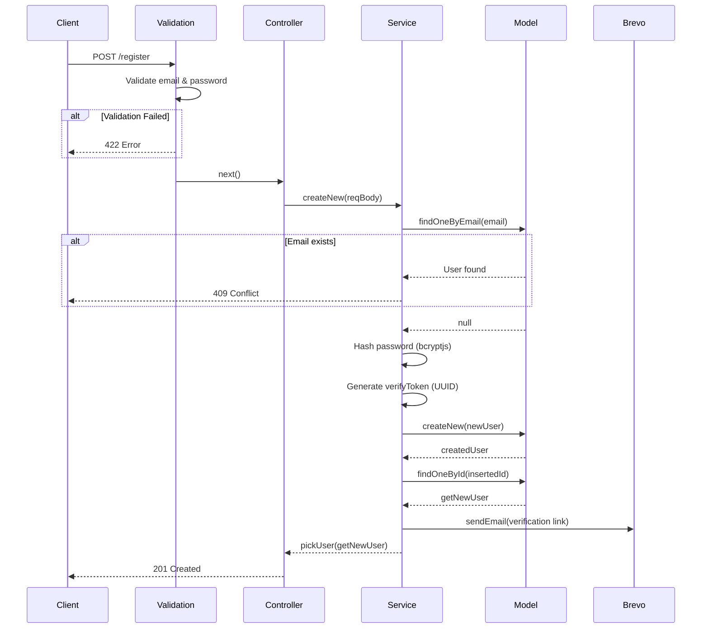

# 🔐 Authentication API Documentation

Tài liệu API cho các chức năng **Đăng ký (Register)** và **Đăng nhập (Login)** của Trello Backend.

---

## 📋 Base URL

```
http://localhost:8017/v1/users
```

---

## 📝 1. Đăng ký tài khoản (Register)

Tạo tài khoản người dùng mới và gửi email xác thực.

### Endpoint

```http
POST /v1/users/register
```

### Request Headers

| Header         | Value              | Required |
| -------------- | ------------------ | -------- |
| `Content-Type` | `application/json` | ✅ Yes   |

### Request Body

```json
{
  "email": "user@example.com",
  "password": "Password123"
}
```

### Validation Rules

| Field      | Type   | Rules                                                                             |
| ---------- | ------ | --------------------------------------------------------------------------------- |
| `email`    | string | ✅ Required, phải đúng format email (regex: `/^\S+@\S+\.\S+$/`)                   |
| `password` | string | ✅ Required, tối thiểu 8 ký tự, phải có ít nhất 1 chữ cái và 1 số (regex pattern) |

> **Password Regex:** `/^(?=.*[a-zA-Z])(?=.*\d)[A-Za-z\d\W]{8,256}$/`

### Response

#### ✅ Success (201 Created)

```json
{
  "_id": "6789abc123def456789ghijk",
  "email": "user@example.com",
  "username": "user",
  "displayName": "user",
  "avatar": null,
  "role": "client",
  "isActive": false,
  "createdAt": 1706367860000,
  "updatedAt": null
}
```

| Field         | Type    | Description                                |
| ------------- | ------- | ------------------------------------------ |
| `_id`         | string  | MongoDB ObjectId của user                  |
| `email`       | string  | Email đã đăng ký                           |
| `username`    | string  | Username được tự động tạo từ email         |
| `displayName` | string  | Tên hiển thị (giống username ban đầu)      |
| `avatar`      | string  | URL avatar (null nếu chưa có)              |
| `role`        | string  | Quyền của user: `client` hoặc `admin`      |
| `isActive`    | boolean | Trạng thái kích hoạt (`false` khi mới tạo) |
| `createdAt`   | number  | Timestamp tạo tài khoản                    |
| `updatedAt`   | number  | Timestamp cập nhật gần nhất                |

#### ❌ Error Responses

| Status Code | Condition           | Response Body                                               |
| ----------- | ------------------- | ----------------------------------------------------------- |
| 409         | Email đã tồn tại    | `{ "statusCode": 409, "message": "Email already exists!" }` |
| 422         | Validation thất bại | `{ "statusCode": 422, "message": "<validation error>" }`    |

### Flow xử lý



### Lưu ý quan trọng

1. **Email Verification**: Sau khi đăng ký thành công, hệ thống sẽ gửi email xác thực đến địa chỉ email của người dùng
2. **isActive = false**: Tài khoản mới tạo sẽ ở trạng thái chưa kích hoạt
3. **Password hashing**: Mật khẩu được hash bằng `bcryptjs` với salt rounds = 8

---

## 🔑 2. Đăng nhập (Login)

> ⚠️ **Chưa được implement** - API này cần được phát triển thêm

### Endpoint (Đề xuất)

```http
POST /v1/users/login
```

### Request Body (Đề xuất)

```json
{
  "email": "user@example.com",
  "password": "Password123"
}
```

### Response (Đề xuất)

#### ✅ Success (200 OK)

```json
{
  "accessToken": "eyJhbGciOiJIUzI1NiIsInR5cCI6IkpXVCJ9...",
  "refreshToken": "eyJhbGciOiJIUzI1NiIsInR5cCI6IkpXVCJ9...",
  "user": {
    "_id": "6789abc123def456789ghijk",
    "email": "user@example.com",
    "username": "user",
    "displayName": "user",
    "avatar": null,
    "role": "client",
    "isActive": true
  }
}
```

#### ❌ Error Responses (Đề xuất)

| Status Code | Condition                    | Message                          |
| ----------- | ---------------------------- | -------------------------------- |
| 401         | Email hoặc password sai      | "Email or password is incorrect" |
| 403         | Tài khoản chưa được xác thực | "Account is not verified"        |
| 422         | Validation thất bại          | `<validation error message>`     |

---

## 📊 User Schema

```javascript
{
  email: String,        // Required, unique
  password: String,     // Required, hashed
  username: String,     // Required, từ email
  displayName: String,  // Required
  avatar: String,       // Default: null
  role: String,         // "client" | "admin", default: "client"
  isActive: Boolean,    // Default: false
  verifyToken: String,  // UUID cho email verification
  createdAt: Date,      // Auto-generated
  updatedAt: Date,      // Default: null
  _destroy: Boolean     // Soft delete, default: false
}
```

---

## 🔧 Ví dụ sử dụng với cURL

### Đăng ký

```bash
curl -X POST http://localhost:8017/v1/users/register \
  -H "Content-Type: application/json" \
  -d '{
    "email": "test@example.com",
    "password": "MyPassword123"
  }'
```

### Đăng ký (JavaScript/Fetch)

```javascript
const response = await fetch("http://localhost:8017/v1/users/register", {
  method: "POST",
  headers: {
    "Content-Type": "application/json",
  },
  body: JSON.stringify({
    email: "test@example.com",
    password: "MyPassword123",
  }),
});

const data = await response.json();
console.log(data);
```

---

## 📁 Related Files

| File                                | Description                       |
| ----------------------------------- | --------------------------------- |
| `src/routes/v1/userRoute.js`        | Route definitions                 |
| `src/controllers/userController.js` | Controller logic                  |
| `src/services/userService.js`       | Business logic                    |
| `src/validations/userValidation.js` | Request validation                |
| `src/models/userModel.js`           | Database model                    |
| `src/utils/validators.js`           | Validation rules (regex patterns) |
| `src/providers/BrevoProvider.js`    | Email service provider            |
